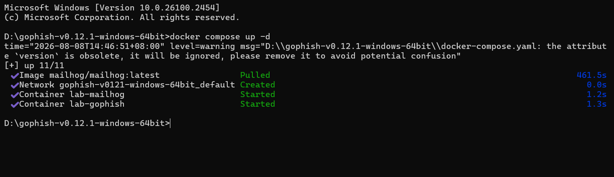

# Panduan Setup Awal Laboratorium Phishing (GoPhish + MailHog) via Docker

Panduan ini digunakan untuk membangun laboratorium simulasi serangan *social engineering* dan *phishing* yang 100% aman, gratis, dan terisolasi di dalam komputer lokal menggunakan **Docker Compose** di Windows/Linux.

---

## 1. Persyaratan Sistem
*   **Docker Desktop** sudah terinstal dan berjalan di sistem operasi utama.
*   Koneksi internet (hanya untuk pengunduhan *image* Docker di awal).

---

## 2. File Konfigurasi (`docker-compose.yml`)

Buat sebuah folder baru (misalnya `D:\Lab-Phishing` atau `~/lab-phishing`), kemudian buat file bernama `docker-compose.yml` dan isi dengan skrip berikut:

```yaml
version: '3.8'

services:
  # 1. Server SMTP Palsu (MailHog)
  mailhog:
    image: mailhog/mailhog:latest
    container_name: lab-mailhog
    ports:
      - "1025:1025" # Port SMTP untuk GoPhish
      - "8025:8025" # Port Web UI untuk melihat email masuk

  # 2. Platform Phishing (GoPhish)
  gophish:
    image: gophish/gophish:latest
    container_name: lab-gophish
    ports:
      - "3333:3333" # Port Admin Dashboard GoPhish
      - "80:80"     # Port Landing Page Phishing
    depends_on:
      - mailhog
```

---

## 3. Langkah-Langkah Menjalankan Laboratorium

### Langkah A: Eksekusi Container
1. Buka **Command Prompt (CMD)**, **PowerShell**, atau **Terminal Linux**.
2. Masuk ke folder tempat Anda menyimpan file `docker-compose.yml`:
   ```bash
   cd D:\Lab-Phishing
   ```
3. Jalankan perintah berikut untuk mengunduh gambar dan mengaktifkan layanan di latar belakang (*detached mode*):
   ```bash
   docker compose up -d
   ```
    

### Langkah B: Mengambil Kata Sandi Admin GoPhish
GoPhish menghasilkan kredensial acak unik pada pembuatan pertama. Ambil kata sandi tersebut melalui *log* Docker dengan perintah:
```bash
docker logs lab-gophish
```
Cari baris teks yang serupa dengan format ini:
`Please login with the username admin and the password: [KATA_SANDI_ACAK_ANDA]`
*Salin kata sandi acak tersebut.*

---

## 4. Akses Layanan Melalui Browser

Setelah kedua wadah (*container*) berstatus *Started*, buka browser Anda dan akses tautan berikut:

1.  **Dasbor Admin GoPhish:**
    *   **URL:** `https://localhost:3333`
    *   *Catatan:* Jika muncul peringatan keamanan SSL (*Your connection is not private*), klik **Advanced** -> **Proceed to localhost (unsafe)**.
    *   **Kredensial Awal:** Username `admin` dan masukkan kata sandi acak yang telah disalin dari langkah sebelumnya. Anda akan langsung diminta untuk mengubah kata sandi default tersebut.
2.  **Kotak Masuk MailHog (Web UI):**
    *   **URL:** `http://localhost:8025`
    *   Semua email *phishing* yang dikirim dari GoPhish akan ditangkap dan mendarat di halaman ini secara instan tanpa memerlukan koneksi internet ke luar.

---

## 5. Menghubungkan GoPhish ke SMTP MailHog

Agar GoPhish dapat mengirimkan email tiruan ke MailHog, ikuti konfigurasi profil pengiriman berikut di dalam Dasbor GoPhish:

1.  Masuk ke menu **Sending Profiles** di panel sebelah kiri.
2.  Klik **New Profile**.
3.  Isi kolom formulir dengan detail di bawah ini:
    *   **Name:** `SMTP-Lokal-Docker`
    *   **From Address:** `keamanan@bank-lokal.com` *(Anda bebas menulis alamat email palsu apa saja sebagai simulasi pengirim)*
    *   **Host:** `mailhog:1025` *(PENTING: Di dalam jaringan internal Docker Compose, kita memanggil nama layanan `mailhog`, bukan alamat IP 127.0.0.1)*
    *   **Username:** *(Kosongkan)*
    *   **Password:** *(Kosongkan)*
4.  Klik tombol **Send Test Email** untuk menguji konektivitas, lalu masukkan email target asal (misalnya: `target@perusahaan.com`).
5.  Periksa tab browser **MailHog (`http://localhost:8025`)**. Jika email uji coba berhasil masuk, klik **Save Profile** di GoPhish.

Laboratorium simulasi Anda kini telah siap digunakan sepenuhnya secara offline dan aman.
