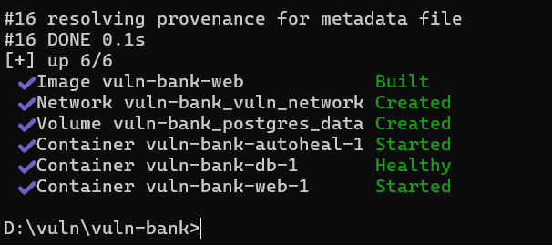

# Vulnerable Bank Application (Vuln-Bank)

Aplikasi web perbankan sengaja dibuat memiliki celah keamanan (vulnerable) untuk tujuan pembelajaran, pengujian penetrasi (pentesting), dan simulasi keamanan siber.

---

## 🛠️ Prasyarat Sistem
Sebelum memulai, pastikan komputer Anda sudah terpasang:
* **Git** (untuk kloning repositori)
* **Docker Desktop** (pastikan sudah berjalan/running)
* **VS Code** atau teks editor sejenis (untuk perbaikan format berkas)

---

## 🚀 Langkah Instalasi & Menjalankan Aplikasi

Ikuti panduan berikut secara berurutan menggunakan **Command Prompt (CMD)** yang dijalankan sebagai **Administrator**:

### 1. Nyalakan Docker lewat CMD (Opsional)
Jika Docker Desktop belum aktif, Anda bisa memicu aplikasinya langsung lewat terminal:
```cmd
start "" "C:\Program Files\Docker\Docker\Docker Desktop.exe"
```
*Tunggu sekitar 10-20 detik hingga Docker Engine benar-benar siap.*

### 2. Kloning Repositori dan Masuk ke Folder Proyek
Pindah ke drive penyimpanan Anda (misal Drive D), lalu unduh kode aplikasinya:
```cmd
d:
cd D:\vuln
git clone https://github.com
cd vuln-bank
```

### 3. Konfigurasi Git untuk Pengguna Windows (Penting)
Agar Git tidak otomatis mengubah format baris file Linux menjadi format Windows di kemudian hari, jalankan perintah ini:
```cmd
git config --global core.autocrlf false
```

### 4. Jalankan Docker Compose
Bangun kontainer, unduh dependensi, dan jalankan aplikasi di latar belakang:
```cmd
docker-compose up -d --build
```


---

## ❌ Panduan Troubleshooting (Solusi Error)

### Masalah 1: Error `npipe:////./pipe/dockerDesktopLinuxEngine: The system cannot find the file specified.`
* **Penyebab:** Docker Desktop belum berjalan atau servisnya membeku (*freeze*).
* **Solusi:** 
  1. Buka aplikasi Docker Desktop secara manual atau gunakan perintah `start` pada Langkah 1.
  2. Jika masih error, jalankan CMD sebagai **Administrator** dan ketik: `net start com.docker.service`.

### Masalah 2: Kontainer `web-1` Muter Terus & Log Berisi `exec ./start.sh: no such file or directory`
* **Penyebab:** Windows mengubah karakter perpindahan baris file `start.sh` menjadi format **CRLF**. Docker (Linux) tidak mengenali format ini dan menganggap jalur skripnya rusak.
* **Solusi Perbaikan (LF):**
  1. Buka folder proyek `vuln-bank` menggunakan **VS Code**.
  2. Klik dan buka file bernama **`start.sh`**.
  3. Perhatikan **pojok kanan paling bawah** pada layar VS Code Anda.
  4. Klik teks bertuliskan **`CRLF`**, lalu pada menu atas yang muncul, pilih opsi **`LF`**.
  5. Simpan file dengan menekan **Ctrl + S**.
  6. Buka kembali CMD, lalu bersihkan kontainer lama dan bangun ulang dengan perintah:
     ```cmd
     docker-compose down -v
     docker-compose up -d --build
     ```
     *(Parameter `-v` wajib digunakan untuk menghapus sisa volume database yang menggantung).*

---

## 🌐 Cara Mengakses Aplikasi
Setelah semua kontainer di Docker Desktop berwarna **hijau (Running)**, buka web browser Anda dan akses tautan berikut:

* **Aplikasi Utama:** [http://localhost:5000](http://localhost:5000) atau [http://127.0.0.1:5000](http://127.0.0.1:5000)
* **Dokumentasi API:** [http://localhost:5000/api/docs](http://localhost:5000/api/docs)
* **GraphQL Analytics:** [http://localhost:5000/graphql](http://localhost:5000/graphql)

---

## 🛑 Peringatan Keamanan
Aplikasi ini mengandung celah keamanan fatal yang nyata. **HANYA** jalankan aplikasi ini di lingkungan lokal (*localhost*) komputer Anda. Jangan pernah menyebarkan (*deploy*) aplikasi ini ke server publik atau internet hosting!
